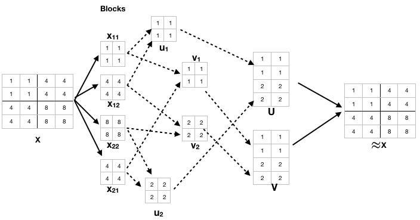

# Block GPU Matrix Factorization

Matrix  factorization  is  well  known  technique  for  various machine  learning  problems  ranging  from  recommender  systems to text mining. The simplicity of the technique is based on deriving underlying latent factors leading to a behavior by utilization of large data of observed behaviors.

Matrix  Factorization  on  a  GPU  gives  substantial  performance gain as the number of computations are nearly dividedby number of GPU cores leveraged. However, the amount of memory  available  on  a  typical  GPU  is  limited  and  for  large datasets it may not be possible to compute  matrix factorization in one go with all data transferred into GPU cache. The memory required for a data matriX can be arrived as ≈(n×m + n×k + k×m)×c for some constant c bytes taken to represent each element. Hence the space complexity ≈O(n^2). Considering k as constant, and as n,m → 10^6, the numberof memory units required ≈10^12

The Block GPU matrix factorization considers the data matrix as a block matrix and factorization of each block is achieved on GPU. 




Above figure demonstrates a simple example with 4 blocks each factorized individually and then combined together to form U,V. The approach is shown in the above figure considers  each  block  as  an  individual  matrix for  factorization. The algorithm factorizes each block for few  iterations  and  the  latent  features  of  each  of  the blocks are taken as  a  starting  point  for  computation  of  latent  features for  relevant  blocks  afterwards.  

## Getting Started


### Prerequisites

```
Python 3.0
CUDA v8.0
pyCUDA v1.8

The GPU based Block matrix factorization has been developed using python using pyCUDA support.

```

### Installing


```
git clone 'https://github.com/17mcpc14/blockgmf'

```

## Running the tests

Below MF implmentations are hardcoded to run on data/R.txt - a randomly generated dataset of 1000x1000 dimension with values ranging from 0 - 30. 

```
1. src/cpumf.py - CPU based MF implementation with SGD convergence
2. src/blockcpumf.py - CPU based BMF implementation with SGD converegence
3. src/blockparallelcpumf.py - CPU based BMF with parallel/multi-threaded implementation with SGD convergence
```

**Note:** the programs can be simply modified from R.txt to any other dataset. 

## Authors

* **Prasad Bhavana** - *Initial work* 

## License

This project is licensed under the MIT License - see the [LICENSE.md](LICENSE.md) file for details

## Acknowledgments

* Vineet C Padmanabhan, Professor, University of Hyderabad
