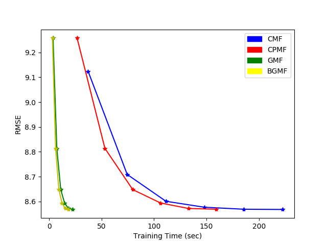

# Block GPU Matrix Factorization

Matrix  factorization  is  well  known  technique  for  various machine  learning  problems  ranging  from  recommender  systems to text mining. The simplicity of the technique is based on deriving underlying latent factors leading to a behavior by utilization of large data of observed behaviors.

Matrix  Factorization  on  a  GPU  gives  substantial  performance gain as the number of computations are nearly dividedby number of GPU cores leveraged. However, the amount of memory  available  on  a  typical  GPU  is  limited  and  for  large datasets it may not be possible to compute  matrix factorization in one go with all data transferred into GPU cache. The memory required for a data matriX can be arrived as ≈(n×m + n×k + k×m)×c for some constant c bytes taken to represent each element. Hence the space complexity ≈O(n^2). Considering k as constant, and as n,m → 10^6, the numberof memory units required ≈10^12

The Block GPU matrix factorization (BGMF) considers the data matrix as a block matrix and factorization of each block is achieved on GPU. 


Above figure demonstrates a simple example with 4 blocks each factorized individually and then combined together to form U,V. The approach is shown in the above figure considers  each  block  as  an  individual  matrix for  factorization. The algorithm factorizes each block for few  iterations  and  the  latent  features  of  each  of  the blocks are taken as  a  starting  point  for  computation  of  latent  features for  relevant  blocks  afterwards. BGMF provides a framework that can be used by other matrix factorization optimization approaches for scaling up as well providing parallelism and distributed computation along with GPU acceleration. BGMF relies on kernel implementation that takes partial data elements to achieve MF and hence currently it
is implemented using Stochastic Gradient Descent (SGD). However, the approach can be extended to approximate tech-niques based on Alternating Least Squares (ALS) approach that uses partial data. The performance of BGMF against CPU variant, multi-threaded CPU variant and regular GPU variant can be seen in below diagram for a psuedo random data set:



## Getting Started


### Prerequisites

```
Python 3.0
CUDA v8.0
pyCUDA v1.8

The GPU based Block matrix factorization has been developed using python using pyCUDA support.

```

### Installing


```
git clone 'https://github.com/17mcpc14/blockgmf'

```

## Running the tests

The project contains 4 different variants of similar SGD kernel
```
1. src/cmf.py - CPU based MF implementation with SGD convergence
2. src/cpmf.py - Multi-threaded CPU based BMF implementation with SGD converegence
3. src/gpmf.py - Atomic GPU based MF with parallel implementation with SGD convergence
4. src/bgmf.py - Block based GPU accelerated MF with SGD convergence

All above programs can be invoked through invocation of respective MF methods (factorize/block_factorization). Alternatively the same can be invoked from respective main programs as below:

1. src/main_cmf.py <ml-100k/train.csv> <ml-100k/test.csv> <2000>
2. src/cpmf.py <ml-100k/train.csv> <ml-100k/test.csv> <2000> <16>
3. src/gpmf.py <ml-100k/train.csv> <ml-100k/test.csv> <16> <2000> <1> 
4. src/bgmf.py <ml-100k/train.csv> <ml-100k/test.csv> <16> <2000> <1>

```

**Note:** the programs can be run with R.txt (Rtrain.csv, Rtest.csv> or any other dataset. 

## Authors

* **Prasad Bhavana** - *Initial work* 

## Acknowledgments

* Vineet C Padmanabhan, Professor, University of Hyderabad
